# 🤖 GitHub Copilot + Advanced CodeQL DevSecOps Security Lab


---

# 📌 Project Overview

This project demonstrates an AI-assisted DevSecOps security workflow using GitHub Copilot, GitHub CodeQL, and GitHub Actions to identify, remediate, and validate security vulnerabilities throughout the software development lifecycle.

The project begins by using GitHub Copilot to generate application code containing intentional security weaknesses. The vulnerable implementation is committed to a GitHub repository and automatically analyzed using GitHub CodeQL security scanning.

CodeQL successfully detected a security vulnerability related to clear-text logging of sensitive information and generates security alerts inside GitHub Security and Quality.

After identifying the vulnerability, GitHub Copilot is used again to assist with secure code remediation. The insecure implementation is replaced with a secure version, while the original vulnerable code is preserved separately as security evidence for demonstration purposes.

Because the repository contains intentional vulnerable code inside the evidence directory, a customized Advanced CodeQL workflow is implemented. The custom configuration ensures that CodeQL scans the complete repository while excluding only the intentionally preserved evidence folder.

The final implementation validates that the custom CodeQL workflow can successfully detect new vulnerabilities across the repository while ignoring excluded evidence files, demonstrating an effective DevSecOps security scanning approach.

---

# 🎯 Objectives

- Demonstrate security risks in AI-generated source code.
- Use GitHub Copilot for AI-assisted code generation and secure remediation.
- Implement automated Static Application Security Testing (SAST) using CodeQL.
- Detect vulnerabilities through GitHub Code Scanning.
- Analyze and understand CodeQL security findings.
- Remediate vulnerabilities using secure coding practices.
- Configure Advanced CodeQL workflow customization.
- Exclude intentional security evidence files from vulnerability scanning.
- Validate that CodeQL continues scanning application code correctly.
- Demonstrate complete vulnerability lifecycle management:
  - Detection
  - Analysis
  - Remediation
  - Validation
  - Closure

---

# 🛠️ Tools and Technology Used

| Tool / Technology | Purpose |
| --- | --- |
| GitHub Copilot | AI-assisted insecure code generation and secure code remediation |
| GitHub CodeQL | Static Application Security Testing (SAST) and vulnerability detection |
| GitHub Actions | Automated security scanning workflow execution |
| GitHub Security and Quality | Vulnerability alert management and tracking |
| JavaScript | Application source code language |
| Visual Studio Code | Source code development and repository management |
| Git and GitHub | Version control and collaboration platform |

---

# 📂 Repository Structure

```text
copilot-security-lab
│
├── .github
│   │
│   ├── codeql-config.yml
│   │
│   └── workflows
│       └── codeql-analysis.yml
│
├── docs
│   └── security-evidence
│       └── login-insecure.js
│
├── screenshots
│   └── 01-30 Security Evidence Screenshots
│
├── src
│   └── login.js
│
└── README.md
```

---

## 🔁 Implementation Workflow

### Phase 1: AI-Assisted Insecure Code Generation

GitHub Copilot was used to generate application code for a login functionality. The generated implementation contained a **sensitive information exposure** vulnerability through clear-text logging. This vulnerable code was intentionally committed and pushed to the repository for security analysis.

---

### Phase 2: Default CodeQL Security Scanning

GitHub Code Scanning was enabled using the default CodeQL setup.

**Workflow execution:**

```text
Developer Push
      |
      v
GitHub Actions Triggered
      |
      v
Default CodeQL Analysis
      |
      v
Security Finding Generated
```

CodeQL successfully detected the vulnerability:

- **Type:** Clear-text logging of sensitive information
- **File:** `src/login.js`
- **Location:** GitHub Security and Quality → Code Scanning

---

### Phase 3: Vulnerability Analysis and AI-Assisted Remediation

The detected vulnerability was reviewed via the CodeQL security alert, confirming that sensitive data was being exposed through insecure logging practices.

**Remediation steps:**

1. Reviewed the CodeQL recommendation
2. Prompted GitHub Copilot to rewrite the insecure implementation securely
3. Replaced the vulnerable code with a secure implementation
4. Validated the updated source code

The secure implementation was maintained in `src/login.js`.

---

### Phase 4: Preserving Vulnerable Code as Security Evidence

To document the original vulnerability, the insecure implementation was preserved (not deleted) and relocated to:

```text
docs/security-evidence/login-insecure.js
```

**Purpose of preservation:**

- Maintain evidence of the original vulnerability
- Demonstrate the CodeQL detection process
- Support security analysis documentation

At this point, the repository contained both secure application code and intentionally vulnerable evidence code — introducing a new scanning challenge.

---

### Phase 5: Issue With Default CodeQL Configuration

The default CodeQL workflow scans the **entire repository** by default. Because the preserved evidence file was still vulnerable code, CodeQL generated a new alert for:

```text
docs/security-evidence/login-insecure.js
```

This alert was technically correct, but not aligned with the project's goal:

- ✅ Scan active application code
- ❌ Ignore intentionally preserved security evidence files
- ✅ Avoid unnecessary/duplicate security alerts

This required migrating to a customized Advanced CodeQL workflow.

---

### Phase 6: Creating an Advanced Custom CodeQL Workflow

A custom CodeQL configuration was created to control scanning scope.

**New files added:**

```text
.github
├── codeql-config.yml
└── workflows
    └── codeql-analysis.yml
```

**Configuration goals:**

- Scan all application source code
- Exclude only the security evidence directory
- Continue detecting vulnerabilities outside excluded paths

**Example exclusion configuration:**

```yaml
paths-ignore:
  - docs/security-evidence/**
```

---

### Phase 7: Migrating From Default to Advanced CodeQL Setup

During implementation, both the default and custom CodeQL workflows attempted to run simultaneously. The custom workflow failed because GitHub does not permit an Advanced CodeQL configuration to run alongside the default setup.

**Issue identified:**

> CodeQL analysis for advanced configurations cannot be processed while the default setup remains enabled.

**Resolution steps:**

1. Disabled the default CodeQL setup
2. Migrated to the Advanced CodeQL configuration
3. Enabled the custom CodeQL workflow

**Result:**

```text
Custom CodeQL Workflow
        ↓
Successful Execution
```

The evidence folder was successfully excluded from scanning.

---

### Phase 8: Validating Custom CodeQL Detection Capability

To confirm the custom workflow was correctly scoped (excluding evidence, but still detecting real vulnerabilities), a temporary test file was introduced:

```text
src/test-vulnerable.js
```

**Test objectives:**

- Verify CodeQL still scans application directories
- Confirm only the evidence folder is excluded

**Result after pushing the test file:**

```text
GitHub Actions
        ↓
Custom CodeQL Scan
        ↓
Vulnerability Detected
        ↓
Security Alert Generated
```

This confirmed the Advanced CodeQL workflow was functioning as intended.

---

### Phase 9: Final Cleanup and Security Validation

After successful validation, the temporary test file was removed:

```text
src/test-vulnerable.js
```

The repository was re-scanned using the custom Advanced CodeQL workflow.

**Final validation results:**

| Metric        | Count |
|---------------|-------|
| Open Alerts   | 0     |
| Closed Alerts | 3     |

The previously detected vulnerability was automatically marked as fixed and moved to the closed security findings section.

---

## ✅ Final Repository Security State

- Secure application code implemented
- Custom Advanced CodeQL workflow enabled
- Evidence folder excluded from scanning
- Vulnerability detection validated
- No active security alerts

---

## 🔑 Key Takeaways

- AI-generated code (e.g., via Copilot) can introduce real security vulnerabilities and must be reviewed, not trusted blindly.
- CodeQL's default setup is repository-wide and does not support fine-grained path exclusions.
- Achieving selective scanning (e.g., excluding evidence/documentation files) requires migrating to an **Advanced CodeQL setup**.
- Default and Advanced CodeQL configurations **cannot run concurrently** — the default setup must be disabled first.
- Validating a custom scanning configuration with a deliberate test case is essential to confirm detection logic still works as expected.

---

# 📸 Project Screenshots

A curated selection of screenshots showcasing the key milestones of this project — from AI-generated vulnerability to final validated, alert-free scanning.

All implementation screenshots are available inside the `screenshots` directory.

---

## 🤖 AI-Assisted Code Generation

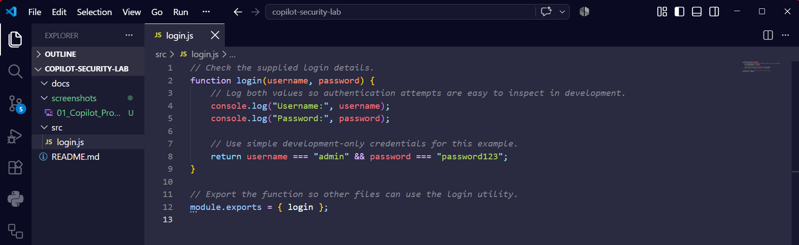
*GitHub Copilot generates an insecure login implementation with clear-text logging.*

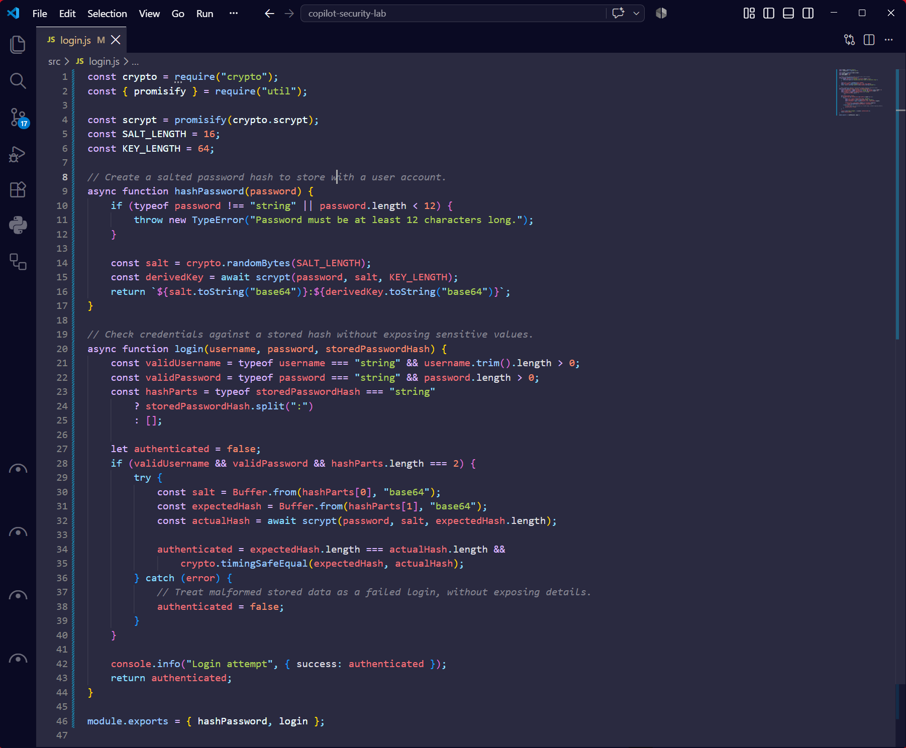
*Copilot-assisted secure rewrite of the vulnerable implementation.*

---

## 🔍 CodeQL Detection

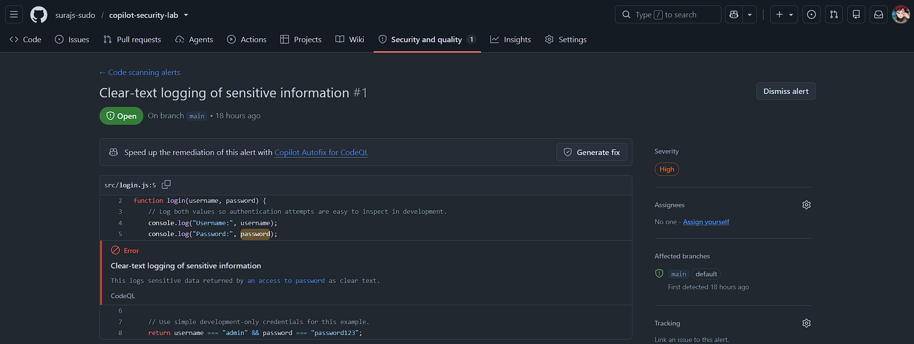
*Default CodeQL scan detects the clear-text logging vulnerability.*

---

## ⚙️ Advanced CodeQL Configuration

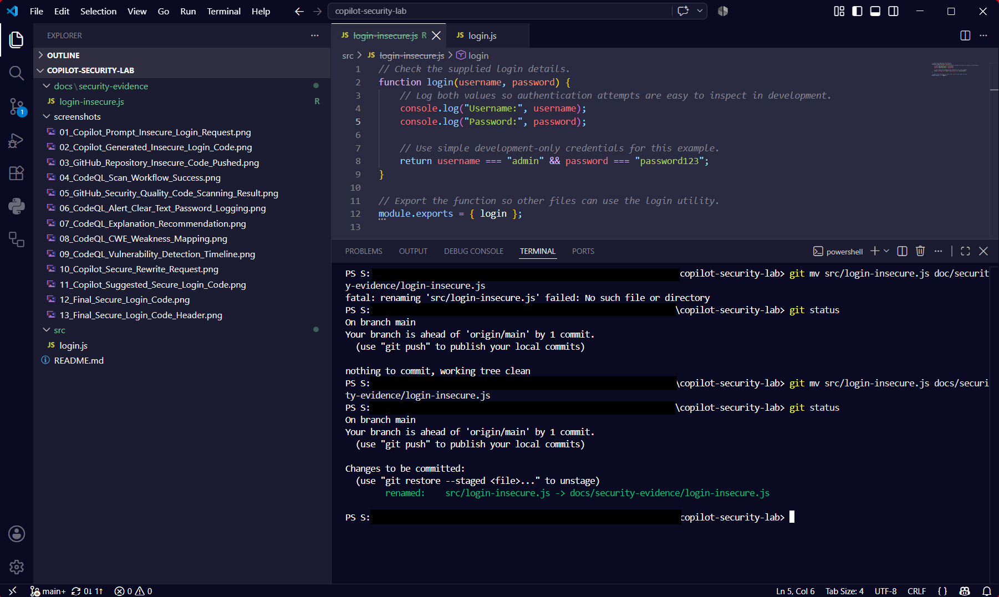
*Vulnerable code preserved as evidence in a dedicated folder.*

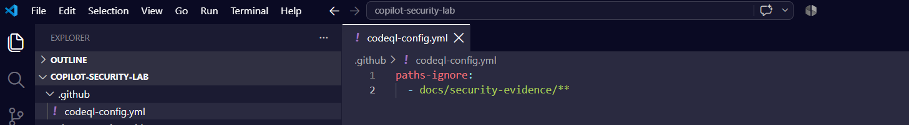
*Custom CodeQL config excluding the evidence folder from scans.*

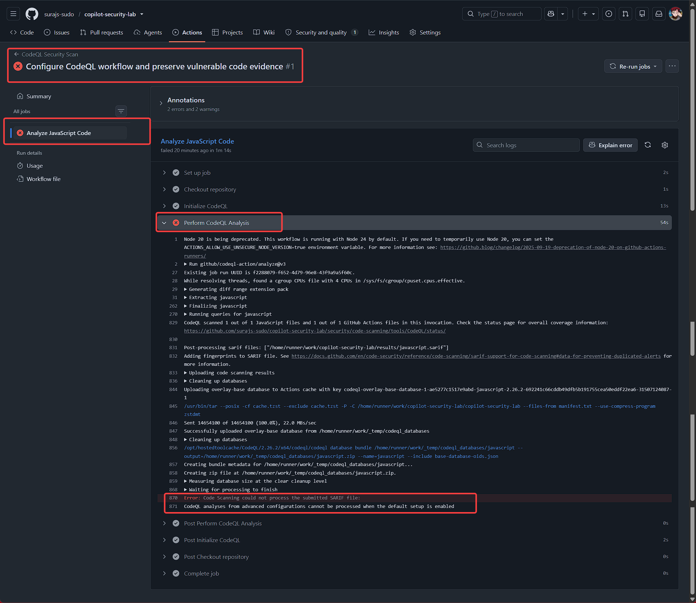
*Conflict error when running Advanced and Default CodeQL setups simultaneously.*

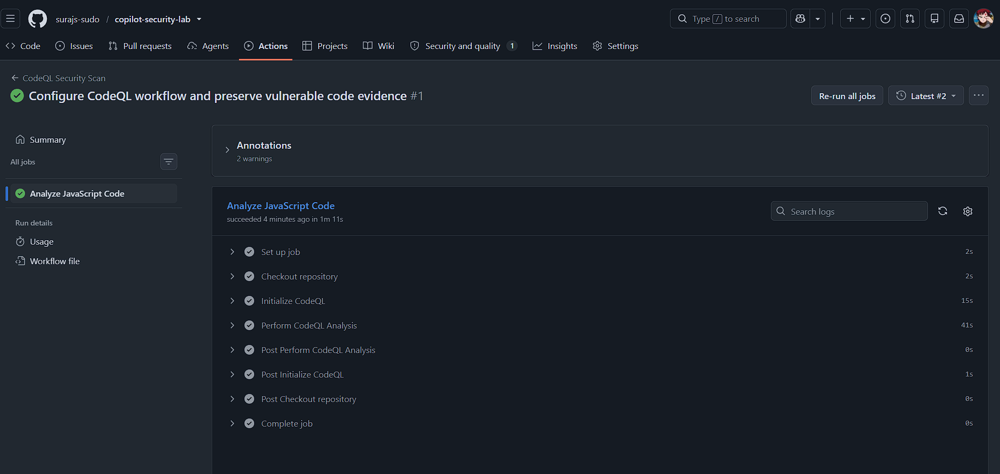
*Custom Advanced CodeQL workflow running successfully after migration.*

---

## ✅ Vulnerability Validation

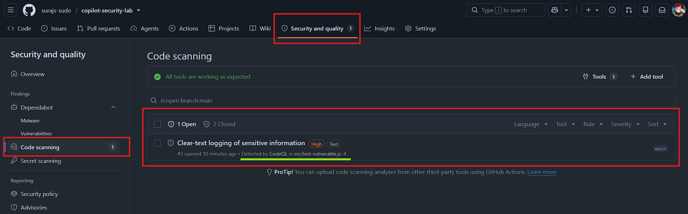
*Test vulnerability confirms the custom workflow still detects real issues.*

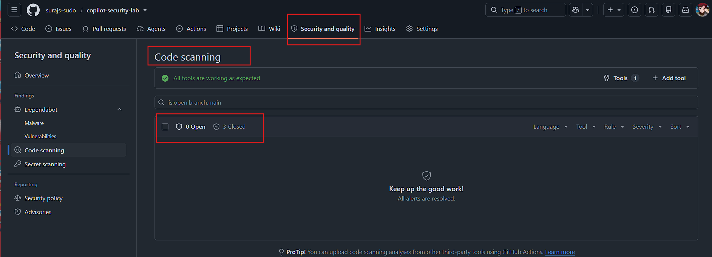
*Final security dashboard showing zero open alerts.*

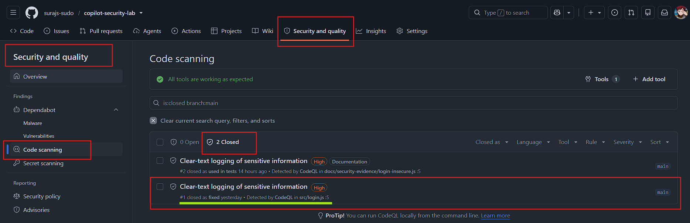

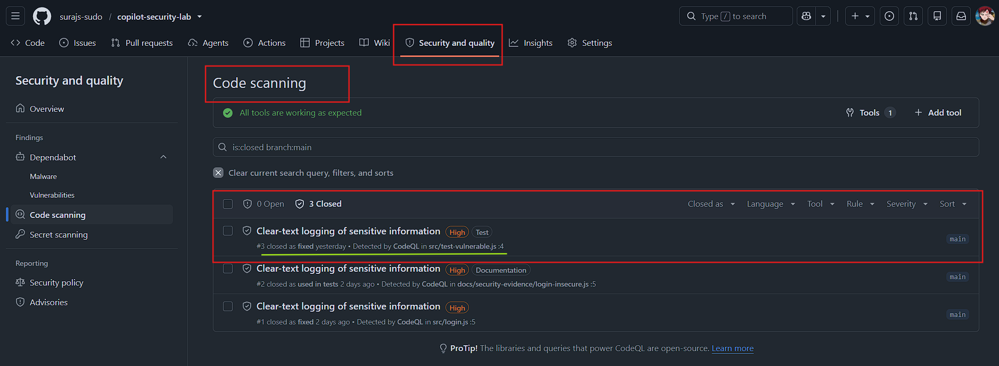
*All alerts successfully resolved and marked as closed.*

---

## ✅ Conclusion

This project successfully demonstrates a complete AI-assisted DevSecOps security workflow using GitHub Copilot and Advanced CodeQL.

The implementation shows how intentionally vulnerable code can be generated, detected, analyzed, remediated, and validated through automated security scanning.

By migrating from the default CodeQL setup to an Advanced custom workflow, the repository achieved controlled security scanning where:

- Application code continues to be analyzed
- Intentional security evidence files are excluded
- Vulnerabilities are detected automatically
- Security alerts are tracked through their complete lifecycle

The final solution represents a practical implementation of secure software development practices by combining AI assistance, automated security testing, and DevSecOps principles.

---

## 👤 Author

**Suraj Somkuwar**

Cybersecurity | Cloud Security | DevSecOps

GitHub: [https://github.com/surajs-sudo](https://github.com/surajs-sudo)